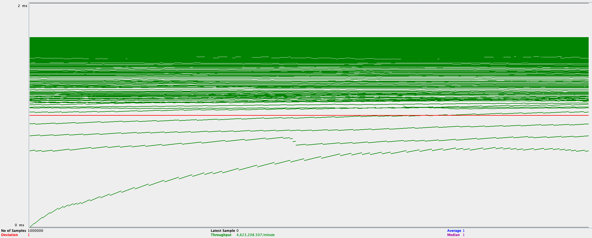

# What is this?

A toy DNS for hobbyists and worried people.

Several goals:

- Rule engine to rewrite/deny queries (implemented)
- Dirt simple to configure (toml syntax)
- No fat. Fast.

# Configuration

Take a look at the content of the `config.toml.template` file. Copy it to `config.toml` and run.

# RFC2136 and LetsEncrypt compatibility

It is possible to run e.g. `certbot` and use this software to automatically provide the answers that LetsEncrypt needs to validate that it can deliver a certificate for a given domain:

```
certbot certonly --test-cert -m you@example.com \
    --config-dir . --work-dir . --logs-dir . \
    --dns-rfc2136 \
    --dns-rfc2136-propagation-seconds 5 \
    --dns-rfc2136-credentials=secrets.ini \
    -d yourhost.example.com
```

Note: remove `--test-cert` to get a production certificate.

# DNS Synchronization

There is currently no notion of primary and secondary DNS. All your DNS instances are equal. It would be fairly easy to implement `IXFR/AXFR` but unless it becomes a mandatory feature, this seems to go against my "no fat/easy to configure" goals. With this being said, you could use something like [Syncthing](https://syncthing.net/) to keep `config.toml` current.

# Tell me more about the DNS repository

In the `github.com/miekg/dns` repository, there was a pull request allowing code using that library to retrieve additional information about the requesting socket. This includes source IP, which can be convenient in a split horizon environment. It lives in this directory (slightly adapted)

# Performance testing

The tests below are performed using authoritative (local) records as my main goal is to offer a server that can survive a brutal assault serving cloud endpoints. Performing the same test against recursed hosts offers similar performance, simply because I am not querying 1M different hosts and the server efficiently* caches responses (while respecting their TTL)

These tests are run locally on a 2020 Macbook M1 Pro and jMeter is using as much CPU as it dares to, while kittendns doesn't even appear in my top output.

(*) dumbly

## jMeter stress testing

1. Run Wireshark to capture a DNS query. In the details window, select the Domain Name System layer, right-click, copy as a hex stream.
2. In jMeter, paste in the "Request Data" area

The jMeter test plan is stored in `KittenDNS jMeter Test Plan.jmx`

Since we are testing DDoS-type scenarios, we are not going to allow any ramp-up. All clients will be hitting the servers from the beginning.

Results:

|Scenario|Queries/Minute|Queries/Second|
|-|-|-|
|1M queued queries for locally resolved hosts|1.3M|21,666|
|1M queued queries for locally resolved, CNAME'd hosts|1.276M|21,417|
|1M queries, but by 100 users, no ramp-up|4.599M|76,650|
|1M queries, 100 users, flattening enabled|4.623M|77,050|
|1M queries, bump to 1,000 users|3.2M|53,333|

Observations:
- If we distribute across 1000 users rather than 100, threading starts degrading.
- Flattening doesn't provide the expected level of improvement.



Latency is pretty good, too.

## Mig testing

https://github.com/infobloxopen/dnstools/tree/master/mig

```
./mig -s 192.168.1.189 -n 1000000 -d domains.lst -o perf.json
python2 ../analyser/fit.py results/perf.json
```

Results:

|Rule Engine|Queries/Minute|Queries/Second|
|-|-|-|
|Enabled|6.7M|111,677|
|Disabled|6.79M|113,181|

Again, a somewhat unexpected result: a lightly loaded rule engine has almost no impact on the server's performance.


# Todo

## Cache improvements

- If flattening is enabled, we should cache the flattened version.
- When flattening, what about recursed and fragmented answers?

## Circuit Breaker (when recursing)/Rate Limiter

Because, realistically, it is better to fail some queries if this will allow them to succeed later.

Rate Limiter: should be limiting some misbehaving clients. Problem: how do we identify a "Client?"
- Is a client a single IP address? If it's a site DNS proxying to us, then it may be allowed higher traffic levels
- Should we throttle a combination of source + queries?

# FAQ

Q: I noticed that you are storing similar records in separate structures. For instance, there is one entry for a A (v4) record,
and another entry for its AAAA (v6) counterpart. This is wastful!

A: You are correct. However, I should not store both entries using the same key because they can both be capitalized differently.
And, little known fact, capitalization in DNS can be a security feature.

# Misc

<div>Logo created by <a href="https://www.designevo.com/" title="Free Online Logo Maker">DesignEvo logo maker</a></div>
